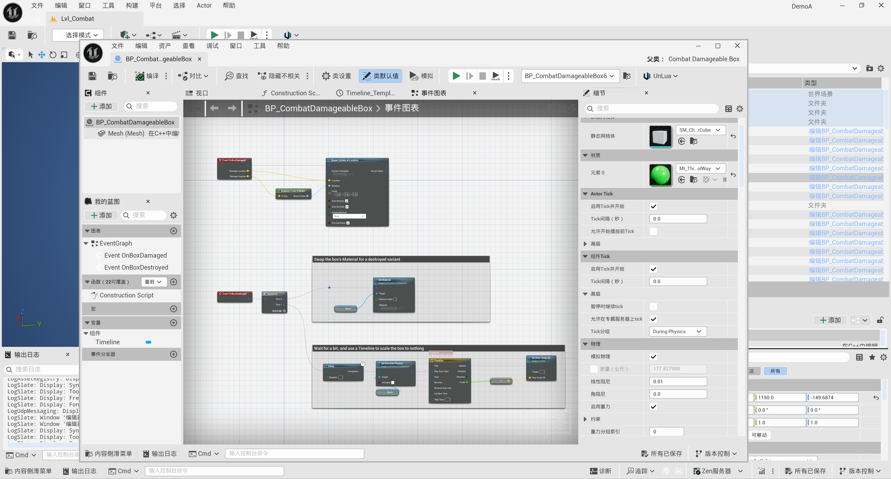

# Light Theme Fix

Light Theme Fix is an editor-only Unreal Engine plugin that installs the clean, neutral **Light** theme and repairs low-contrast Slate widgets that a color-theme JSON cannot style reliably.

By default, the plugin also follows Windows' default app mode: Unreal switches to the bundled **Light** theme in Windows light mode and Unreal's standard **Dark** theme in Windows dark mode. Changes are detected while the editor is running.

The current binary release targets **Unreal Engine 5.8 on Win64**. The archive also includes source code so it can be rebuilt against another compatible engine build.

## Preview

The Unreal Editor after enabling the bundled **Light** theme and the plugin's contrast fixes:



## What it fixes

- Focused text in search boxes, numeric fields, editable text boxes, and inline editors
- Combo-box rows and dock-tab foregrounds
- Blueprint graph background, grid, breadcrumbs, node bodies, titles, and execution wires
- Animation Editor timeline rows and labels
- Content Browser hover and selection states
- Tooltip text created after editor startup
- Late editor shutdown without accessing `CoreUObject` after engine exit begins

Every feature can be enabled independently. Colors, luminance threshold, node geometry, timeline colors, Content Browser states, and runtime refresh timing are available under **Editor Preferences > Plugins > Light Theme Fix**. Settings are per user and per project.

## Installation

1. Download the release archive for your Unreal Engine version.
2. Extract it so the descriptor is located at one of these paths:
   - `<YourProject>/Plugins/LightThemeFix/LightThemeFix.uplugin`
   - `<YourEngine>/Engine/Plugins/Marketplace/LightThemeFix/LightThemeFix.uplugin`
3. Enable **Light Theme Fix** in the Plugins panel and restart the editor.
4. Unreal automatically selects **Light** or **Dark** to match Windows. To choose a theme manually, disable **Follow Windows Theme** under **Editor Preferences > Plugins > Light Theme Fix** and restart the editor.

The bundled theme is copied once to the current user's Unreal theme directory. Existing copies are intentionally preserved so local theme edits are never overwritten.

## Configuration

Open **Editor Preferences > Plugins > Light Theme Fix**. Settings marked as restart-required rebuild the parent Slate style at the next editor launch. Graph grid and execution-wire colors update with theme changes; tooltip and focused-input corrections run only while their feature switches are enabled.

`Follow Windows Theme` is enabled by default and reads Windows' `AppsUseLightTheme` preference at startup and at the configured check interval. Automatic switches are persisted to Unreal's application-appearance setting, so the preference page stays in sync.

`Apply Only to Light Themes` is enabled by default. It gates graph grid/wire colors and runtime tooltip/input corrections when Unreal's dark theme is active. Parent-style changes marked as restart-required are installed at startup, so disable their individual feature switches if you do not want those overrides.

## Building from source

For normal project development, place the repository in `<Project>/Plugins/LightThemeFix` and build the project's Editor target.

To produce the same distributable archive used for releases:

```powershell
.\Scripts\BuildRelease.ps1 -EngineRoot 'D:\EpicGame\UE_5.8'
```

The script runs Unreal Automation Tool's `BuildPlugin`, creates a versioned zip under `Dist`, and writes a matching SHA-256 file. Debug symbols are omitted by default; pass `-IncludeDebugSymbols` to retain PDB files.

## Troubleshooting

- **The theme is not listed:** verify the plugin loaded, then restart the editor. The installed file is named `Light.json` in Unreal's per-user theme directory.
- **Unreal reports incompatible binaries:** use a release built for the exact engine version, or delete the plugin's `Binaries` and `Intermediate` directories and compile the Editor target locally.
- **A search field still uses white focused text:** include the editor panel, engine version, and a screenshot in the issue. Some editor modules use concrete Slate subclasses rather than the base `SEditableTextBox` type.
- **A setting appears unchanged:** options with the restart marker are captured when the Slate parent style is created and require an editor restart.

## Compatibility and scope

- Tested: Unreal Engine 5.8, Win64
- Module type: Editor only; it is not loaded into packaged games
- No project assets or gameplay code are modified
- Third-party editor widgets with private styles may need an additional targeted override

## Contributing

See [CONTRIBUTING.md](CONTRIBUTING.md). Visual fixes should be checked in both the bundled light theme and Unreal's default dark theme, and every release must pass an editor shutdown test.

## License

[MIT](LICENSE)

## 中文说明

将 `LightThemeFix` 文件夹放到项目的 `Plugins` 目录，启用插件并重启编辑器。插件默认跟随 Windows 的应用主题：浅色模式自动使用 **Light**，深色模式自动使用 **Dark**，并会在编辑器运行期间响应系统主题变化。如需手动选择主题，请在“编辑器偏好设置 > 插件 > Light Theme Fix”中关闭 **Follow Windows Theme** 后重启编辑器。

上方截图展示了启用 Light 主题与插件对比度修复后的编辑器效果。

所有功能开关与颜色参数位于“编辑器偏好设置 > 插件 > Light Theme Fix”。插件只修改编辑器界面，不会改动游戏资产或进入打包后的游戏。若预编译 DLL 与你的 UE 小版本不一致，请删除插件的 `Binaries`、`Intermediate` 后重新编译编辑器目标。
